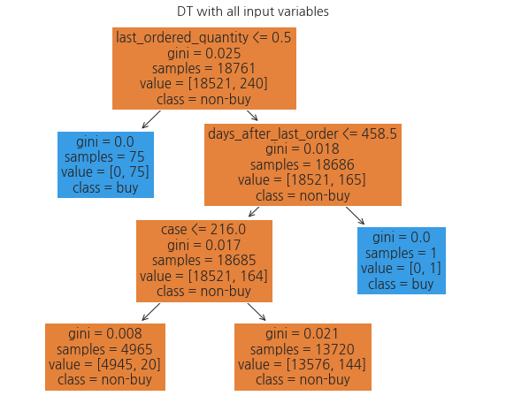

# maskvendor

- survey url: <http://naver.me/FU35Hb4O>
- survey data: `survey data.csv`

### data preperation and exploration
- Code: `data preprocesing and exploration.ipynb`([here](https://github.com/ejklike/maskvendor/blob/main/data%20preprocessing%20and%20exploration.ipynb))
- Decision Tree 학습하여 시각화해본 결과, `last_ordered_quantity = 0`이면 구매한다라는 규칙을 학습하고 있음 (첫 번째 노드).

- 이는 구매자 별 최초 구매시 변수값을 가지는 row는 변수 `last_ordered_quantity`의 값이 `0`이 되기 때문이며, 총 75명의 구매자가 있기에 이러한 row가 75개 있는 것으로 나타남.
- 최초 구매 row 75줄을 제거하면 학습이 거의 되지 않음